# **To do list fullstack**

This is a personal study project that is a to-do list application that includes the main pillars necessary for a web product.

In the topics below you can see the main pillars of this application.

## **Database**

An SQLite relational database is used to manipulate application data.

The database is concentrated in two main tables:

- **User**: table responsible for storing the id, username and password data of each user registered in the application.
- **Task**: table responsible for storing the task id, task name and user id data that owns the activity.

In the image below you can see an entity relationship diagram that is present in the application database:

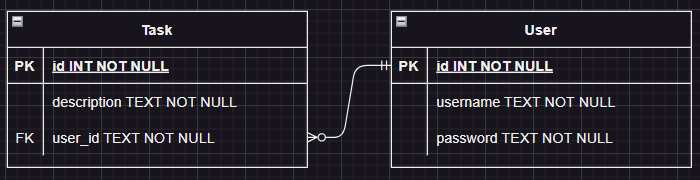

## **Task API**

The Task API is responsible for carrying out all backend operations present in the application.

It is a Rest API with HTTP protocol capable of receiving and sending data in JSON format.

The API is divided into two main topics:

### **User**

Responsible for handling users’ registration data.

Its three endpoints are as follows:

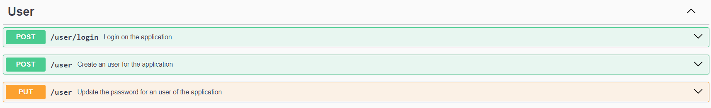

#### **POST /user/login**

The POST /user/login endpoint is responsible for providing a JWT that will be used by the user to access other endpoints that require authentication.

The following parameters must be sent to obtain authentication:

```json
{
  "username": "string",
  "password": "string"
}
```

If the request is successful, there will be the following return:

```json
{
  "auth": true,
  "token": "string"
}
```

#### **POST /user**

The POST /user endpoint is responsible for registering new users within the application.

The following parameters must be sent to register a new user:

```json
{
  "username": "string",
  "password": "string"
}
```

If the request is successful, there will be the following return:

```json
{
  "message": "User created successfully"
}
```

#### **PUT /user**

The PUT /user endpoint is responsible for updating the password of a user already registered in the system.

The following parameters must be sent to update the password:

```json
{
  "username": "string",
  "password": "string",
  "newPassword": "string"
}
```

If the request is successful, there will be the following return:

```json
{
  "message": "Password updated successfully"
}
```

### **Task**

Responsible for manipulating task data within the application.

All task endpoints require authentication. Its five endpoints are as follows:

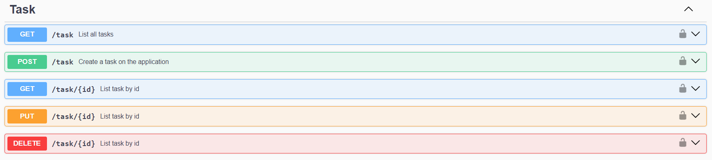

#### **GET /task**

The GET /task endpoint
is responsible for listing all tasks registered by the user.

If the request is successful, there will be the following return:

```json
{
  "id": 0,
  "description": "string",
  "user_id": 0
}
```

#### **POST /task**

The POST /task endpoint is responsible for registering a new task for the user.

The following parameters must be sent to register a new task:

```json
{
  "description": "string"
}
```

If the request is successful, there will be the following return:

```json
{
  "message": "Task created successfully"
}
```

#### **GET /task/{id}**

The GET /task/{id} endpoint is responsible for listing a specific task based on the id provided.

As a parameter, it is necessary to inform the **task id** through the endpoint path in the request (for example: **GET /task/1**).

If the request is successful, there will be the following return:

```json
{
  "id": 1,
  "description": "string",
  "user_id": 1
}
```

#### **PUT /task/{id}**

The PUT /task/{id} endpoint is responsible for updating information for a specific task.

As a parameter, it is necessary to inform the **task id** through the endpoint path in the request (for example: **PUT /task/1**).

Additionally, it is necessary to enter the following parameters in the request body.

```json
{
  "description": "string"
}
```

If the request is successful, there will be the following return:

```json
{
  "id": 1,
  "description": "string"
}
```

#### **DELETE /task/{id}**

The DELETE /task/{id} endpoint is responsible for delete a specific task based on the id provided.

As a parameter, it is necessary to inform the **task id** through the endpoint path in the request (for example: **DELETE /task/1**).

If the request is successful, there will be the following return:

```json
{
  "message": "Task deleted successfully"
}
```

For more details about the task API, you can access the swagger documentation with the API working through the link http://localhost:3000/api-docs.

## **Frontend**

The application's frontend was developed with HTML, CSS and Vanilla JS.
You can see each of the application screens in the topics below:

### **Login screen**

The login screen is where the user, if registered, can access the application in order to check their registered tasks.

You can access the login screen through the path **/frontend/loginPage/login-page.html**.

You can see an image of the screen itself below:

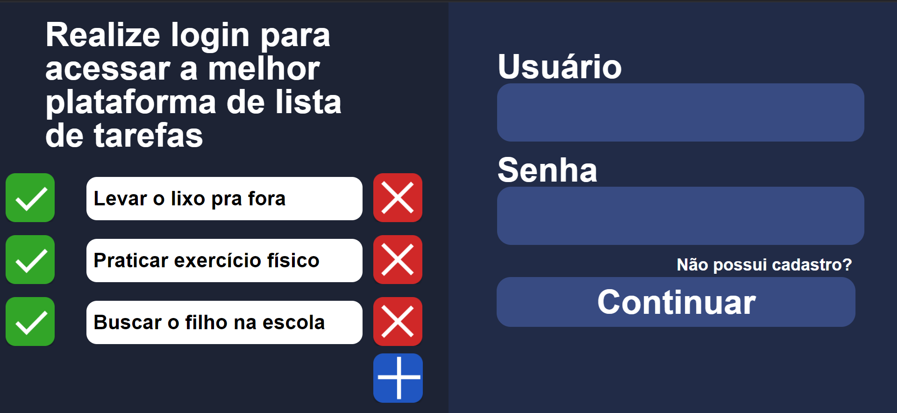

### **Register screen**

The registration screen is where the user can register in the database in order to operate in the application.

You can access the login screen through the path **/frontend/registerPage/register-page.html**.

You can see an image fo the screen itself below:

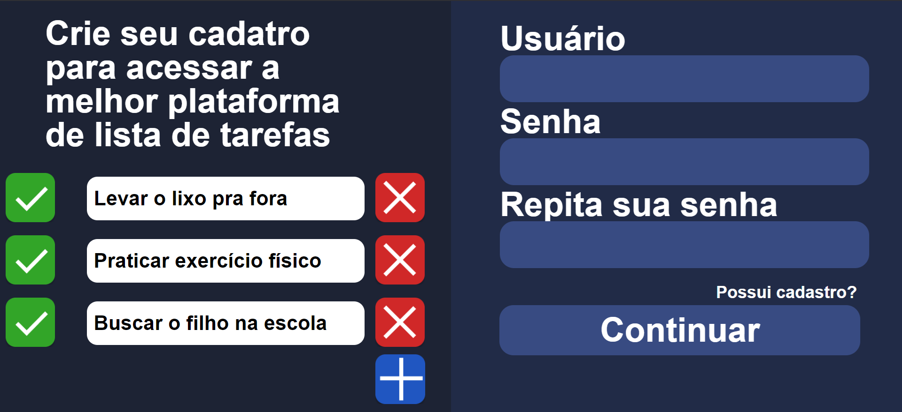

### **Main screen**

The main screen is where the user can create, update, read and delete their tasks.
In addition, he can also access the password update screen and logout.

You can access the login screen through the path **/frontend/mainPage/main-page.html**.

You can see an image fo the screen itself below:

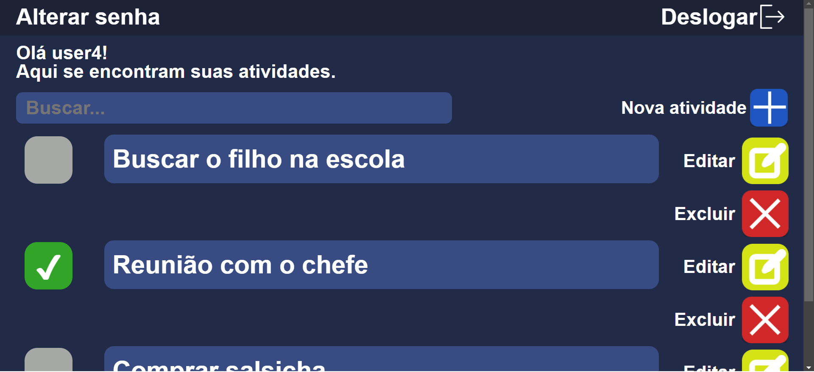

To create or update a task, the user will access the following modals:

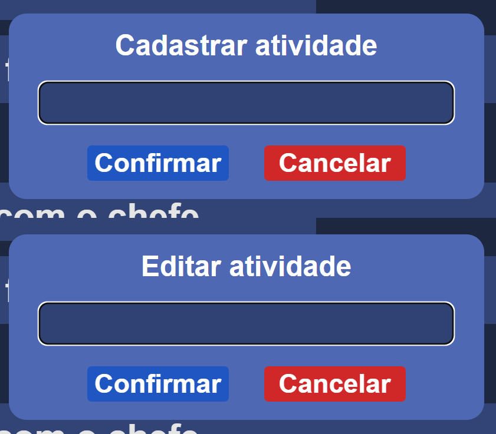

### **Password update screen**

The password update screen is where the user can update their registration password to access the application.

You can access the login screen through the path **/frontend/updatePasswordPage/update-password-page.html**.

You can see an image fo the screen itself below:
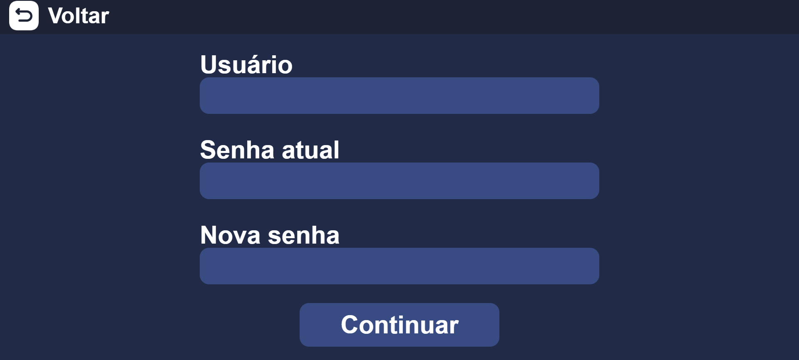

## **How to execute the project**

To run the project, you must have Node.js installed on the machine. If the user does not have Node.js installed, they can install it through the following link: **https://nodejs.org/en**

With Node.js installed on the machine, you need to open the project in the root folder within the CMD terminal:

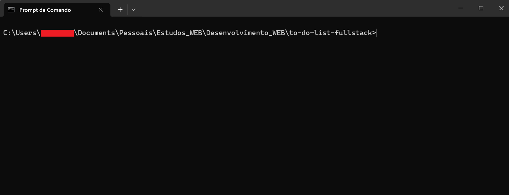

With the project root folder open in CMD, you need to execute the following command:

```
npm install
```

After installing the project's dependencies with the above command, successful installation information should be displayed:


When the project dependencies are already installed, you need to execute the following command:

```
npm run dev
```

After executing the above command, the Task API will be executed:

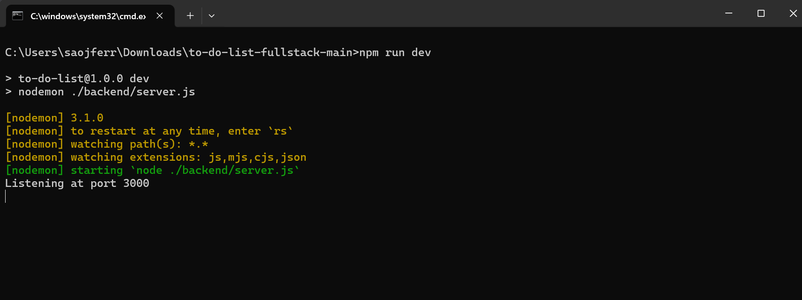

With the Task API live, simply access the login-page.html file present in the path ./frontend/loginPage:

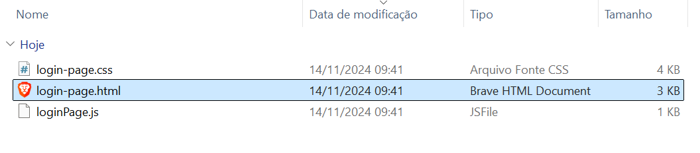
